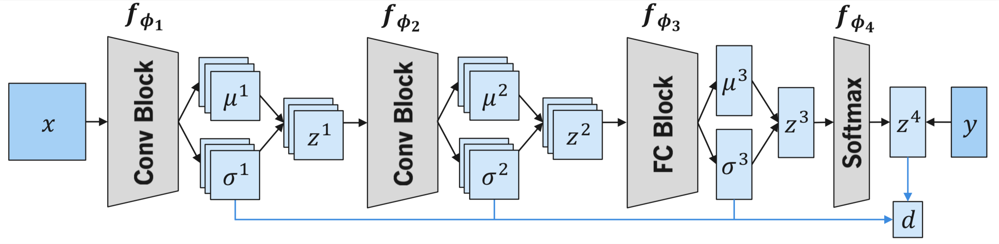
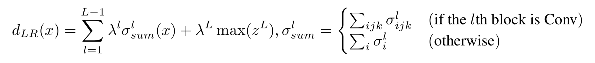
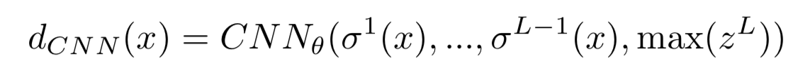
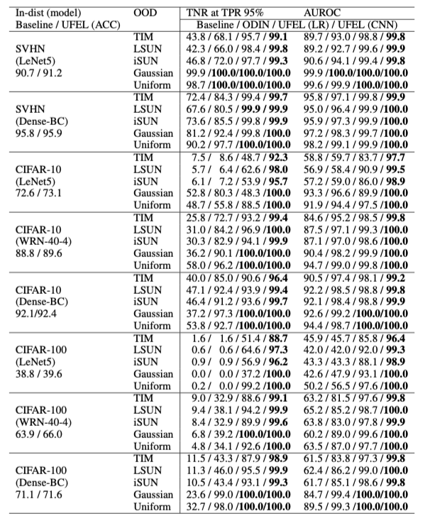

# Out-of-Distribution Detection Using Layerwise Uncertainty in Deep Neural Networks

This is a [Pytorch](https://pytorch.org/get-started/locally/) implementation for detecting out-of-distribution examples.
We propose a method that extracts the Uncertainties of Features in Each Layer (UFEL) and combines them for detecting OOD samples when solving classification tasks.
Some codes are from [odin](https://github.com/facebookresearch/odin), [confidence_estimation](https://github.com/uoguelph-mlrg/confidence_estimation), [deep_Mahalanobis_detector](https://github.com/pokaxpoka/deep_Mahalanobis_detector), [densenet-pytorch](https://github.com/andreasveit/densenet-pytorch), and [WideResNet-pytorch](https://github.com/xternalz/WideResNet-pytorch).

## model architecture

<p align="center">

</p>

Network structure of our method when using DenseNet. **Black arrow**: Extracting the variance of latent features using the reparameterization trick. **Blue arrow**: Combining these features.

### How to combine the features

1. Logistic regression

<p align="center">

</p>

2. Convolutional neural network

<p align="center">

</p>

## Experimental Results
We evalute the performance of OOD detection using three different neural network architectures: [LeNet5](http://yann.lecun.com/exdb/publis/pdf/lecun-98.pdf), [WideResNet](https://arxiv.org/abs/1605.07146), [DenseNet](https://arxiv.org/abs/1608.06993). CIFAR-10, CIFAR100 and SVHN are used as the in-distribution datasets, while TinyImageNet, LSUN, iSUN, uniform noise, and Gaussian noise are used as the out-of-distribution datasets.

<p align="center">

</p>

## Usage

### Dependencies
[PyTorch 1.1.0](http://pytorch.org/)  
[torchvision 0.3.0](http://pytorch.org/)  
[tqdm](https://pypi.python.org/pypi/tqdm)  
[scikit-learn](http://scikit-learn.org/stable/)  

### Training

Train a model with `train.py`. Training logs and checkpoints will be stored in the `./weights`.

LeNet5 on SVHN
```bash
python train.py --dataset svhn --epochs 10 --num_class 10 --model lenet --lr 0.0005 --rep 0,1,1
```

DenseNet on CIFAR-100
```bash
python train.py --dataset cifar100 --epochs 200 --num_class 100 --model dense --layer 100 --rep 1,1,1
```


### Out-of-distribution detection

Evaluate a trained model with `test.py`. Before running this you will need to download the out-of-distribution datasets from Shiyu Liang's [odin](https://github.com/ShiyuLiang/odin-pytorch#downloading--out-of-distribtion-datasets) and place them to `./data`.
Results will be stored in the `./results`.

LeNet5 on SVHN
```bash
python test.py --dataset svhn --num_class 10 --model lenet --rep 0,1,1
```

DenseNet on CIFAR-100
```bash
python test.py --dataset cifar100 --num_class 100 --model dense --layer 100 --rep 1,1,1
```
